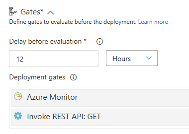

## The Problem

[eShopWorld](https://www.eshopworld.com/) is a fast growing and dynamic company that is attracting new customers at a very agressive rate. How do we provision all their infactrsture in a repeatable way, and help to isolate the technology from large elements of customization that is required when dealing with these large global brands.

## The Solution

We looked at [Open Source](https://opensource.guide/how-to-contribute/), all the types of contribution flows, not just code and took inspiration from that flow, from the filtering that is in place as open source projects onboard hundreds of external comunity contributors: the rejection and acceptance flows.

Forks naturally became a 1st class citizen in our solution, where we intentionally allow technical debt to be done in the context of a Fork. These, if damaged, only work in a multi-tenanted deployment pipeline, where the context of code within a fork is scoped to a single tenant, so multi-tenancy in a CI/CD pipeline became a 1st class citizen also.

As with Open Source contribution flows, only the component owners will actually be able to complete Pull Requests and they are the gatekeepers of the original source. Merging back to origin is a technical task, it's outside any business delivery and it has it's own timeframe and work span, so we get into the task mind-set of *it's ready when it's ready* (i.e. the [Valve Time](https://developer.valvesoftware.com/wiki/Valve_Time) famous *it's ready when it's ready* timeframes) which is the natural fit for technical excelence work.

We've just introduced the **two key concepts of our solution**:
- **The Core Repositories**: Where the original code lives in and owned by a small group of trusted developers.
- **The Tenant Forks**: Where we fork the core repos in the scope of a single tenant and disengage from any technical gatekeeping processes. We instead apply the technical gates when the fork tries to get merged back into the core repo. If this never happens, we don't really care because Sierra will do enough work to effectively cost tenants, so that we can have a real cost associated with a set of forks.

There is an extension to the second concept where we allow UI components to have multiple forks per tenant, what we call *UI experiences* since a common business problem we have is a tenant wanting several types of UI (experiences) targeting a single API. These sometimes fit in the scope of UI themming, but sometimes the amount of customization is so high that they need to have their own life cycle within their own tenant UI forks.

## Where does Sierra fit in

Sierra is the tool that will orchestrate tenants in environments, repositories and the respective CI/CD pipelines. After just a few tenants, the number of moving parts will be already too high to manage manually, so the need to do all this through code is implicit in our solution.

**What Sierra doesn't do:**
- Deployments. It will create and manage the Build definitions and Release definitions in VSTS, but not trigger them.
- Manage resources outside infrastructure orchestration. A good example is user management in API Manager.
- Manage infrastructure access rights. Anything RBAC related is outside the scope of Sierra.
- Tenant onboarding tasks, whatever the tenant is related to, is outside the scope of Sierra.

## Continuous Integration pipelines

Each core repo or any fork of a core repo will have his own CI pipeline. Forks get an aditional task that will attempt to merge back from the core origin on each CI build and check for conflicts, if there are any, CI will break because it highlights the fact that the fork is using the wrong extensability model.

## Continuous Deployment pipelines

The hard boundary between core and forks is the VSTS project. So forks will live in a seperate VSTS project that the original core repos. This means that we can achieve security rules at the project level, so that Sierra doesn't have to deal with setting up the proper fork permissions during creation.

All release pipelines will be driven from the core VSTS project, but they may collect CI artefacts from the forks VSTS project. Here's an example of the artefact list of a Tenant build:

The first set of artefacts is a fork, while the 2nd and 3rd are core repos, so this tenant has a customized fork of component-a that's being collected from the forks VSTS project while the others are core repos collected from the same VSTS project where the release definition is located.

Because a lot of focus is going into customization through code and settings injections, we don't expect to have a high number of forks in the entire platform. For each tenant that has no forks we are doing ring deployments where the number of the ring matches the tier of the tenant, so a release pipeline will look like this (where EU is a region in Europe and US a region in the United States):

Each ring will be gated by an API that monitors application insights feeds and by the Azure monitor alert level, so if there's something wrong with the previous ring deployment it won't be allowed to go any further. An example of the proposed gates:

